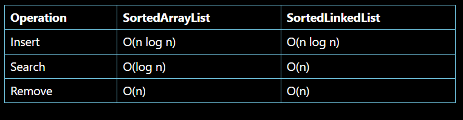
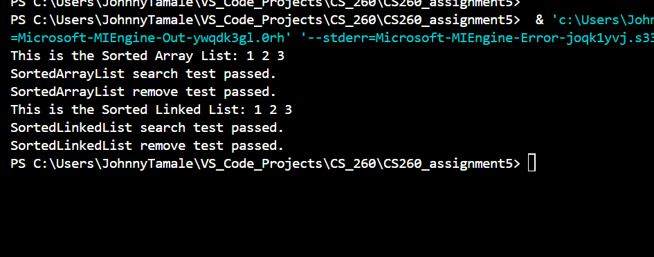

# CS260_assignment5 assisted by githubcopilot

1. `SortedArrayList`:
   - `insert`: The `push_back` operation is O(1), but the `sort` operation is O(n log n), so the overall complexity is O(n log n).
   - `search`: The `binary_search` operation is O(log n).
   - `remove`: The `remove` operation is O(n), and the `erase` operation is also O(n), so the overall complexity is O(n).

2. `SortedLinkedList`:
   - `insert`: The `push_back` operation is O(1), but the `sort` operation is O(n log n), so the overall complexity is O(n log n).
   - `search`: The `find` operation is O(n).
   - `remove`: The `remove` operation is O(n).

Output of the tests.

